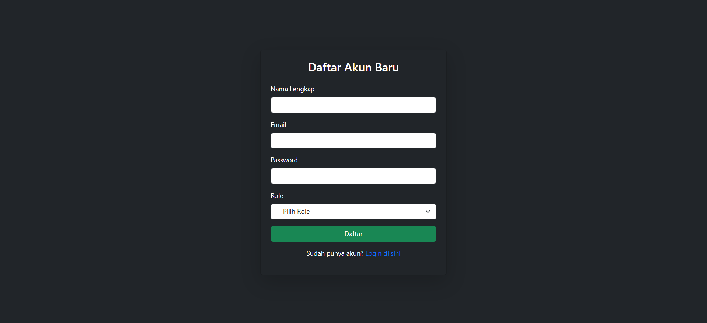
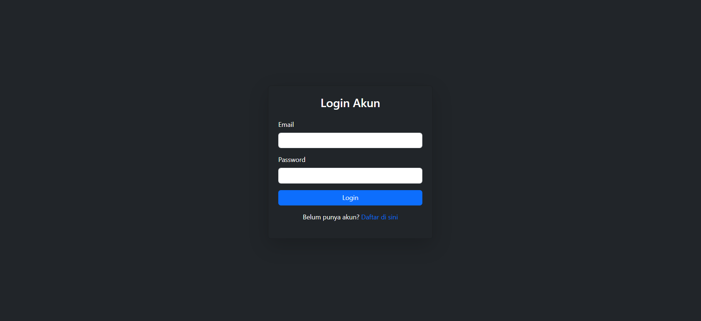
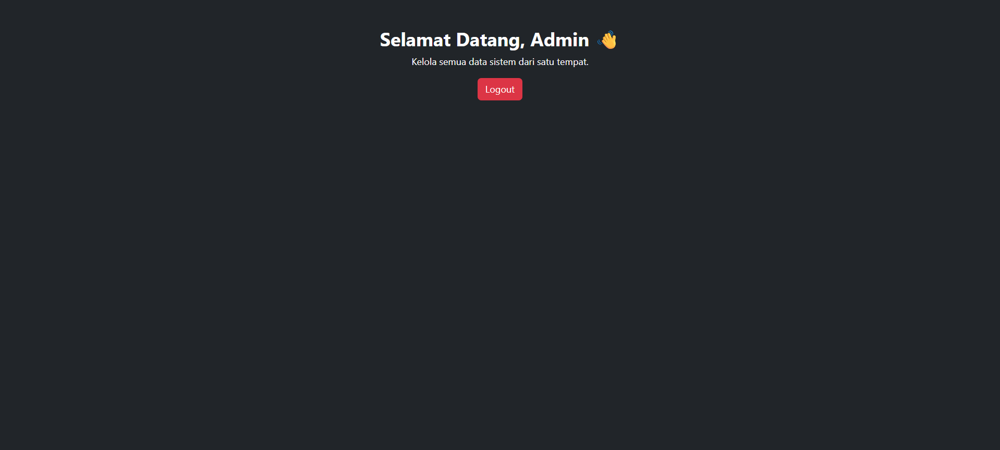
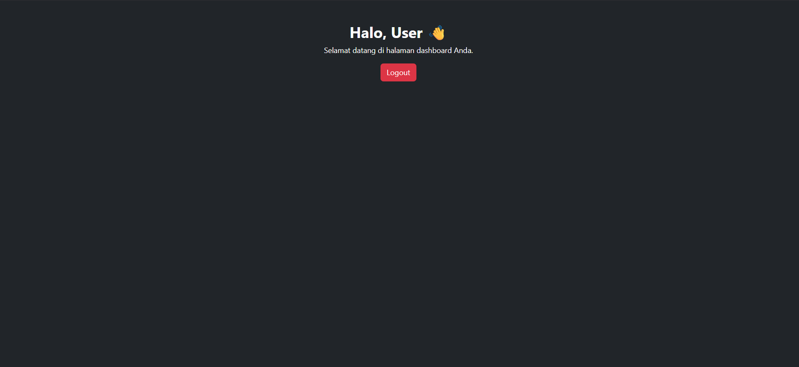

<p align="center"><a href="https://laravel.com" target="_blank"></a></p>

# 🔐 Sistem Login Laravel 12 (Role Admin & User)

Proyek ini merupakan **sistem login sederhana berbasis Laravel 12** dengan fitur **multi-role** (`admin` dan `user`), serta tampilan modern menggunakan **Bootstrap 5**.  
Didesain agar mudah dipahami dan bisa dijadikan dasar untuk pengembangan aplikasi web yang lebih kompleks.

---

## 🚀 Fitur Utama

- ✅ Register akun baru dengan pemilihan **role (admin / user)**
- ✅ Login & Logout menggunakan **Laravel Auth**
- ✅ Redirect otomatis sesuai role:
  - `admin` → menuju `/admin/dashboard`
  - `user` → menuju `/user/dashboard`
- ✅ Tampilan **responsive** di semua perangkat (mobile, tablet, desktop)
- ✅ Menggunakan **Bootstrap 5** tanpa layout tambahan
- ✅ Validasi input register & login
- ✅ Logout dengan metode POST (aman & sesuai standar Laravel)

---

## 🛠️ Teknologi yang Digunakan

| Komponen | Versi | Keterangan |
|-----------|--------|-------------|
| Laravel | 12.x | Framework utama |
| PHP | 8.3+ | Bahasa backend |
| Bootstrap | 5.3 | Tampilan frontend |
| MySQL | 8.x | Database utama |

---

## ⚙️ Instalasi & Konfigurasi

1. **Clone Repository**
   ```bash
   git clone https://github.com/username/nama-project.git
   cd nama-project
2. **Install Dependencies**
   ```bash
   composer install
3. **Salin File Environment**
   ```bash
   cp .env.example .env
4. **Atur Konfigurasi Database di .env**
   ```bash
   DB_DATABASE=db_login
   DB_USERNAME=root
   DB_PASSWORD=
   ```
5. **Generate Key**
   ```bash
   php artisan key:generate
6. **Jalankan Migrasi**
   ```bash
   php artisan migrate
7. **Jalankan Server**
   ```bash
   php artisan serve
8. **Bukan di browser**
   ```bash
   http://localhost:8000

---

## 👥 Struktur Role Pengguna
| Role  | Deskripsi                                                 | Akses                           |
| ----- | --------------------------------------------------------- | ------------------------------- |
| Admin | Pengguna dengan akses penuh ke halaman `/admin/dashboard` | Semua data & kontrol sistem     |
| User  | Pengguna biasa                                            | Hanya halaman `/user/dashboard` |

---

## 🧩 Struktur Folder Utama
```bash
app/
 ├── Http/
 │   ├── Controllers/
 │   │   └── AuthController.php
 │   └── Middleware/
 │       └── RoleMiddleware.php
resources/
 └── views/
     ├── admin
         ├── dashboard.blade.php
     ├── user
         ├── dashboard.blade.php   
     ├── login.blade.php
     ├── register.blade.php
routes/
 └── web.php
```

---

## 📸 Tampilan Halaman
### REGISTER

  

### LOGIN
  

### DASHBOARD ADMIN
  

### DASHBOARD USER
  

--- 

# 🤝 Kontribusi
- Fork repo ini
- Buat branch baru (feature/nama-fitur)
- Commit perubahanmu
- Push ke branch
- Buat Pull Request

---

## 📞 Kontak
### 📧 Email: adammiftah196@gmail.com
### 🌐 Website: www.adammiftah.com
###  Tiktok: adammiftah
###  Instagram: _adammiftah
